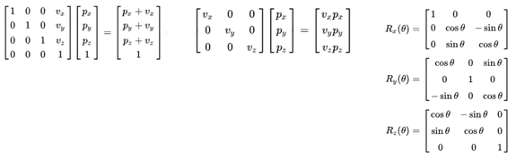

# OpenGL Pipeline 정리

---

## Pipeline 과정


---

### 1. Application (CPU) - Vertex Specification

어플리케이션이 실행되며 API 호출을 통해 Vertex, Color, Texture 좌표 등의 데이터를 준비한다.  
이후 `glDrawArrays`, `glDrawElements`등의 API 호출을 통해 렌더링 시작

---

### 2. Vertex Shatder (GPU)

정점 데이터를 처리하여 화면 좌표로 변환한다.
모델, 뷰, 투영에 행렬을 사용한 변환 수행

---

#### **1. 변환 종류**

##### **(1) 모델 좌표 → 월드 좌표 (모델 변환)**

- 객체의 로컬 좌표(모델 좌표)를 월드 좌표계로 변환.
- **모델 변환 행렬** $M$ 사용.

##### **(2) 월드 좌표 → 뷰 좌표 (뷰 변환)**

- 카메라(또는 관찰자)의 위치와 방향을 기준으로 월드 좌표를 변환.
- **뷰 변환 행렬** $V$ 사용.

##### **(3) 뷰 좌표 → 클립 좌표 (투영 변환)**

- 3D 공간을 2D 화면에 투영.
- 원근법(Perspective) 또는 직교(Orthographic) 투영 방식 사용.
- **투영 변환 행렬** $P$ 사용.

---

#### **2. 행렬 변환**

##### **(1) 모델-뷰-투영 행렬 (MVP)**

- 각 단계에서 적용되는 행렬을 결합하여 전체 변환을 하나의 행렬로 표현 가능:
  $$
  \text{MVP} = P \cdot V \cdot M
  $$
  - $M$: 모델 변환 행렬.
  - $V$: 뷰 변환 행렬.
  - $P$: 투영 변환 행렬.

- **버텍스 쉐이더**는 주로 아래와 같이 변환을 수행:

  ```glsl
  gl_Position = projection * view * model * vec4(position, 1.0);
  ```

---

##### **(2) 모델 변환 행렬**




객체의 각 정점에 행렬을 곱해 객체의 로컬 좌표를 월드 좌표로 변환할 수 있다.
$T(Translation), R(Rotation), S (Scale)$

---

##### **(3) 뷰 변환 행렬**

- 카메라의 위치와 방향을 기준으로 월드 좌표계를 카메라 좌표계(View Space)로 변환.
- OpenGL에서는 일반적으로 카메라가 원점(0,0,0)에 위치하고, $-Z$ 방향을 바라보는 것으로 가정.

###### **구성 요소**

- **카메라 위치** $\mathbf{C}$ (Eye Position).
- **카메라 방향**:
  - $\mathbf{F}$: 전방 벡터(Forward).
  - $\mathbf{R}$: 오른쪽 벡터(Right).
  - $\mathbf{U}$: 위쪽 벡터(Up).

###### **뷰 행렬 계산**

1. 전방 벡터:
   $$
   \mathbf{F} = \frac{\mathbf{Target} - \mathbf{C}}{||\mathbf{Target} - \mathbf{C}||}
   $$
2. 오른쪽 벡터:
   $$
   \mathbf{R} = \frac{\mathbf{F} \times \mathbf{Up}}{||\mathbf{F} \times \mathbf{Up}||}
   $$
3. 새로운 위쪽 벡터:
   $$
   \mathbf{U} = \mathbf{R} \times \mathbf{F}
   $$

4. 뷰 변환 행렬 $ V $:
   $$
   V =
   \begin{bmatrix}
   R_x & R_y & R_z & -\mathbf{R} \cdot \mathbf{C} \\
   U_x & U_y & U_z & -\mathbf{U} \cdot \mathbf{C} \\
   -F_x & -F_y & -F_z & \mathbf{F} \cdot \mathbf{C} \\
   0 & 0 & 0 & 1
   \end{bmatrix}
   $$

- 행렬의 구성:
  - 상단 $3 \times 3$: 카메라 방향 변환.
  - $-\mathbf{R} \cdot \mathbf{C}, -\mathbf{U} \cdot \mathbf{C}, \mathbf{F} \cdot \mathbf{C}$: 카메라 위치 변환.

- **GLM의 `glm::lookAt` 함수**

  - **함수 프로토타입**

  ```cpp
  glm::mat4 glm::lookAt(
      glm::vec3 eye,        // 카메라의 위치
      glm::vec3 center,     // 카메라가 바라보는 대상 위치
      glm::vec3 up          // 카메라의 업 벡터
  );
  ```

##### **(4) 투영 변환 행렬**

- 3D 공간을 2D 화면으로 투영.
- 투영은 **원근 투영(Perspective Projection)** 또는 **직교 투영(Orthographic Projection)** 방식으로 이루어짐.

###### **a. 원근 투영 (Perspective Projection)**

- **특징**: 멀리 있는 객체는 작게, 가까운 객체는 크게 보이도록.
- **행렬 형태**:
  $$
  P =
  \begin{bmatrix}
  \frac{1}{\tan(\frac{fov}{2}) \cdot aspect} & 0 & 0 & 0 \\
  0 & \frac{1}{\tan(\frac{fov}{2})} & 0 & 0 \\
  0 & 0 & \frac{-(far + near)}{far - near} & \frac{-2 \cdot far \cdot near}{far - near} \\
  0 & 0 & -1 & 0
  \end{bmatrix}
  $$

- **구성 요소**:
  - `fov`: 시야각(Field of View).
  - `aspect`: 화면 비율 (너비/높이).
  - `near`, `far`: 가까운 평면과 먼 평면의 거리.

###### **b. 직교 투영 (Orthographic Projection)**

- **특징**: 멀리 있는 객체도 동일한 크기로 보임.
- **행렬 형태**:
  $$
  P =
  \begin{bmatrix}
  \frac{2}{r-l} & 0 & 0 & -\frac{r+l}{r-l} \\
  0 & \frac{2}{t-b} & 0 & -\frac{t+b}{t-b} \\
  0 & 0 & \frac{-2}{far-near} & -\frac{far+near}{far-near} \\
  0 & 0 & 0 & 1
  \end{bmatrix}
  $$

- **구성 요소**:
  - `l, r`: 왼쪽, 오른쪽 평면.
  - `t, b`: 위쪽, 아래쪽 평면.
  - `near, far`: 가까운 평면과 먼 평면의 거리.

---

### 3. Primitive Assembly

정점들을 가지고 점, 선, 삼각형(Primitive)를 만드는 단계

---

### 4. Rasterisation

Primitive(기본 도형: 점, 선, 삼각형 등)를 픽셀(fragment)로 변환하는 과정.

클리핑, 컬링, 뷰포트 변환, 래스터라이즈등을 수행함.

---

#### **클리핑 (Clipping)**

**Primitive(점, 선, 삼각형 등)가 화면에 표시될 수 있는 범위 안에 존재하는지 확인하고, 화면 밖의 부분을 제거**.

1. **목표**:
   - 클립 공간(Clip Space)에서 화면에 표시될 영역만 남기고, 표시되지 않을 부분을 제거.
   - 클립 공간은 정규화된 좌표 영역(Normalized Device Coordinates, NDC)에서 $[-1, 1]$ 범위로 제한.

2. **과정**:
   - 클립 공간에서 벗어난 점은 잘려나거나 새로운 정점으로 분할.
     - 예: 삼각형이 클립 경계에 걸쳐 있을 경우, 클립 경계에 따라 새로운 삼각형으로 분리.
   - 클리핑 이후, 남아 있는 부분은 화면에 그려질 준비를 함.

3. **유형**:
   - **View Frustum Clipping**: 시야 절두체(View Frustum) 영역 안에 있는 것만 렌더링.
   - **Near/Far Plane Clipping**: 카메라의 근평면(near plane)과 원평면(far plane)에서 잘라냄.

---

#### **컬링 (Culling)**

**카메라에서 보이지 않는 면(프리미티브)을 제거하여 렌더링 효율을 높이는 작업**.

1. **목표**:
   - 삼각형(또는 기타 프리미티브)의 **뒷면(back face)** 을 제거하여 처리량을 줄임.
   - 주로 폐쇄형 오브젝트에서 내부 면을 제거.

2. **방식**:
   - 컬링은 삼각형의 **법선 방향(normal vector)** 과 카메라 방향을 비교하여 수행.
   - **시계 방향(CW, Clockwise)** 또는 **반시계 방향(CCW, Counter-clockwise)** 으로 정의된 삼각형의 정점 순서를 기반으로 면이 앞면인지 뒷면인지 판단.

3. **유형**:
   - **Back-face Culling**: 카메라에서 보이지 않는 면(뒷면)을 제거.
   - **Front-face Culling**: 필요 시 앞면을 제거.
   - **Frustum Culling**: 시야 절두체(Frustum) 밖의 객체를 제거.

4. **장점**:
   - 불필요한 면 제거로 GPU 연산량 감소.
   - 렌더링 최적화.

---

#### **뷰포트 변환 (Viewport Transformation)**

**정규화된 장치 좌표(NDC, Normalized Device Coordinates)를 스크린 좌표(Screen Coordinates)로 변환**하는 작업입니다.

1. **목표**:
   - 클립 공간에서 정규화된 좌표($[-1, 1]$)를 실제 화면에서 픽셀 위치로 변환.
   - 렌더링할 뷰포트 영역에 맞게 조정.

2. **과정**:
   $$
   x_{\text{screen}} = \frac{x_{\text{ndc} } + 1}{2} \cdot w_{\text{viewport}} + x_{\text{origin}}
   $$
   $$
   y_{\text{screen}} = \frac{y_{\text{ndc} } + 1}{2} \cdot h_{\text{viewport}} + y_{\text{origin}}
   $$
   - $ x_{\text{ndc} }, y_{\text{ndc} } $: NDC 좌표.
   - $ w_{\text{viewport}}, h_{\text{viewport}} $: 뷰포트의 너비와 높이.
   - $ x_{\text{origin}}, y_{\text{origin}} $: 뷰포트의 시작 좌표.

3. **특징**:
   - 화면에서 특정 영역만 렌더링할 수도 있음 (예: Split Screen, Render Target).
   - **OpenGL**:
     - `glViewport(x, y, width, height)`를 통해 뷰포트 설정.

---

### 5. Fragment Shader

각 픽셀(Fragment)에 대해 색상을 계산한다.
조명 계산, 택스쳐 매핑등을 수행한다.

---

### 6. Frame Buffer

Fragment Shader 출력이 화면의 픽셀에 표시된다.
깊이 테스트, 스텐실 테스트등을 통해 사용할 Fragment를 정하고,  
블렌딩, 디더링, 샘플링을 통해 색상을 자연스럽게 렌더링한다.

---

## CPU 코드와 쉐이더 코드의 관계

### 1. CPU 코드의 역할

CPU 코드(애플리케이션) OpenGL 파이프라인을 제어하고 데이터를 준비한다.

- **쉐이더 프로그램 관리**:
  - 쉐이더 소스 코드 읽기(보통 `.vert`와 `.frag` 파일).
  - 쉐이더 컴파일 및 링크.
  - 쉐이더 변수에 데이터 전달(유니폼, 속성 등).
- **버퍼와 VAO/VBO 설정**:
  - 정점 데이터를 GPU 메모리에 업로드.
  - 렌더링 대상 정의.
- **렌더링 명령 전달**:
  - 드로우 호출로 GPU에 렌더링 명령 실행.

### 2. 쉐이더 코드 (Vertex & Fragment)

- **Vertex Shader (`.vert` 파일)**:
  - 각 정점에 대해 처리 작업을 수행.
  - 모델 변환, 뷰 변환, 투영 변환.
- **Fragment Shader (`.frag` 파일)**:
  - 각 프래그먼트에 대해 처리 작업을 수행.
  - 색상, 조명, 텍스처 매핑을 계산.

### 3. **데이터 전달**

CPU와 쉐이더 코드 간 데이터 전달은 다음 방식으로 이루어진다:

- **유니폼(Uniform)**: 애플리케이션에서 쉐이더로 글로벌 데이터 전달 (예: 변환 행렬, 조명 데이터).
- **속성(Attribute)**: 각 정점에 대해 별도의 데이터 전달 (예: 위치, 텍스처 좌표).
- **VBO(Vertex Buffer Object)**: 정점 데이터를 GPU 메모리에 저장.
- **텍스처**: 이미지 데이터를 GPU에 업로드하고 프래그먼트 쉐이더에서 접근.

---

#### 참고자료

[opengl-graphics-pipeline](https://github.com/rlatkddn212/opengl-graphics-pipeline/blob/master/README.md)
[[OpenGL ES를 이용한 3차원 컴퓨터 그래픽스 입문] 챕터 7 - 래스터라이저](https://j1y00h4.tistory.com/10)
