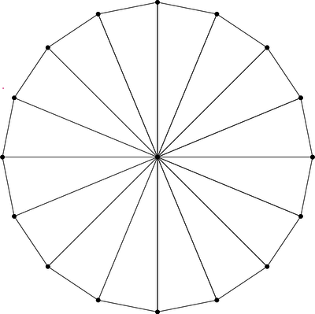

# OpenGL 파이프라인을 기반으로 한 데이터 이동과 처리 흐름 정리

---

## 1. **CPU 데이터 준비**

### (1) **정점 및 인스턴스 데이터 초기화**

- CPU 코드에서 정점(Vertex) 데이터와 원의 인스턴스 데이터(위치, 반지름, 색상 등)를 준비.
  - `update_circle_vertices(NUM_TESS)`:
    - 원의 꼭짓점 데이터를 계산하여 `vertex_list`에 저장
    - 정점 데이터는 원점 `(0, 0)`에서 시작하여 `NUM_TESS`개의 삼각형으로 원을 정의한다.
  - `update_vertex_buffer(NUM_TESS)`:
    - GPU 메모리에 정점 버퍼와 인덱스 버퍼를 생성 및 업로드.
    

    ```cpp
        void update_circle_vertices(uint N) {
            vertex_list.clear();
            vertex_list.push_back({ vec3(0,0,0), vec3(0.0f,0.0f,-1.0f), vec2(0.5f) });
            for (uint k = 0; k <= N; k++) {
                float t = PI * 2.0f / float(N) * float(k);
                float c = cos(t), s = sin(t);
                vertex_list.push_back({ vec3(c,s,0.0f) , vec3(0.0f,0.0f,-1.0f), vec2(c * 0.5f + 0.5f,s * 0.5f + 0.5f) });
            }
        }

        void update_vertex_buffer(uint N) {
            // ... buffer clear
            for (uint k = 0; k < N; k++) {
                index_list.push_back(0);
                index_list.push_back(k + 1);
                index_list.push_back(k + 2);
            }
            // ... buffer upload
        }
    ```

    `update_circle_vertices`에서 한 점을 원점을 기준으로 반시계 방향으로 회전시켜 vertex를 만들고  
    `update_vertex_buffer`에서 반시계 방향으로 변 하나씩을 공유하는 삼각형을 만들도록 index를 구성한다. 
  
### (2) **버퍼 데이터 업로드**

- 정점 데이터 (`vertex_list`)는 `glBindBuffer(GL_ARRAY_BUFFER, vertex_buffer);`를 통해 GPU에 업로드.
- 인덱스 데이터 (`index_list`)는 `glBindBuffer(GL_ELEMENT_ARRAY_BUFFER, index_buffer);`를 통해 GPU에 업로드.

### (3) **유니폼 데이터 설정**

- CPU에서 원의 속성 데이터를 쉐이더에 전달.
  - `glUniform*` 함수로 `radius`, `offset`, `solid_color` 등 데이터를 쉐이더의 유니폼 변수에 설정한다.

---

## 2. **버텍스 쉐이더 단계 (`circ.vert`)**

버텍스 쉐이더는 정점 데이터를 처리하며, 여기서는 **인스턴스화**를 통해 각 원을 개별적으로 설정한다.

### (1) **입력 데이터**

- **정점 속성**: `position`, `normal`, `texcoord` (정점의 위치, 법선 벡터, 텍스처 좌표).
- **유니폼**:
  - `radius[21]`: 각 원의 반지름.
  - `offset[21]`: 각 원의 중심 위치.
  - `aspect_ratio`: 화면의 종횡비.
- **내장 변수**: `gl_InstanceID` (현재 처리 중인 인스턴스 ID).

### (2) **처리 내용**

- 각 정점을 해당 원의 반지름(`radius[gl_InstanceID]`)으로 스케일링 (Scale).
- 회전(Rotate)은 필요 없으므로 생략
- 각 정점의 위치를 해당 원의 중심 위치(`offset[gl_InstanceID]`)로 이동 (Translate).
- 화면의 종횡비(`aspect_ratio`)를 고려하여 위치 조정.

### (3) **출력 데이터**

- `gl_Position`: 최종 변환된 정점의 클립 공간 좌표.
- `norm`, `tc`: 법선 벡터와 텍스처 좌표를 프래그먼트 쉐이더로 전달.

---

## 3. **래스터화 및 프래그먼트 쉐이더 단계 (`circ.frag`)**

래스터화 단계에서 삼각형 프리미티브가 픽셀(fragment)로 변환되며, 각 픽셀은 프래그먼트 쉐이더에서 처리된다.

### (1) **입력 데이터**

- **인터폴레이션된 데이터**:
  - `tc`: 텍스처 좌표 (각 픽셀의 상대 위치).
  - `instanceID`: 처리 중인 인스턴스 ID (flat, 변하지 않음).
- **유니폼 데이터**:
  - `bUseSolidColor`: 단색 여부를 결정하는 플래그.
  - `solid_color[21]`: 각 원의 색상.

### (2) **처리 내용**

- `bUseSolidColor`가 `true`일 경우:
  - 픽셀 색상을 `solid_color[instanceID]`에서 가져옴.
- `bUseSolidColor`가 `false`일 경우:
  - 픽셀 색상을 텍스처 좌표 `tc`를 기반으로 설정.

### (3) **출력 데이터**

- `fragColor`: 최종 픽셀 색상. 화면에 표시될 결과값.

---

## 4. **프레임 버퍼 및 렌더링**

- `glfwSwapBuffers`를 통해 현재 프레임을 화면에 출력함.

---
