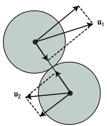
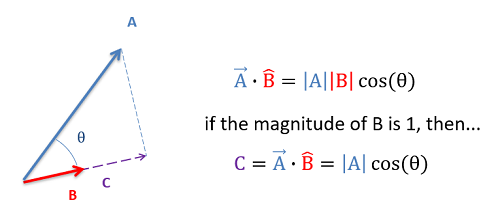

# 완전 탄성 충돌 구현

---

## 완전 탄성 충돌에서 두 물체의 속도 변화 유도

완전 탄성 충돌(elastic collision)은 운동량과 운동에너지가 모두 보존된다.
다음은 두 물체의 충돌 전후 속도를 유도하는 과정이다.

---

### 1. 운동량 보존법칙

두 물체의 질량을 각각 $ m_1 $, $ m_2 $라고 하고, 충돌 전 속도를 $ v_1 $, $ v_2 $, 충돌 후 속도를 $ V_1 $, $ V_2 $라고 할 때, 운동량 보존법칙은 다음과 같이 표현된다:

$$
(1) \quad m_1 v_1 + m_2 v_2 = m_1 V_1 + m_2 V_2  
$$

---

### 2. 운동에너지 보존법칙

$$
\frac{1}{2} m_1 v_1^2 + \frac{1}{2} m_2 v_2^2 = \frac{1}{2} m_1 V_1^2 + \frac{1}{2} m_2 V_2^2
$$

정리하면:

$$
(2) \quad m_1 v_1^2 + m_2 v_2^2 = m_1 V_1^2 + m_2 V_2^2
$$

---

### 3. 상대속도 관계

완전 탄성 충돌에서 두 물체의 상대속도는 충돌 전 후에 반대 방향으로 동일하다:

$$
(3) \quad v_1 - v_2 = -(V_1 - V_2)
$$

이는 (1)과 (2)로부터 유도 가능하다.

---

### 4. 속도 계산 유도

식 (3)을 정리하면:

$$
V_1 = V_2 + v_2 - v_1
$$

이를 식 (1)에 대입하면:

$$
m_1 v_1 + m_2 v_2 = m_1 (V_2 + v_2 - v_1) + m_2 V_2
$$

정리하면:

$$
m_1 v_1 + m_2 v_2 = m_1 V_2 + m_1 v_2 - m_1 v_1 + m_2 V_2
$$

$$
m_1 v_1 + m_2 v_2 + m_1 v_1 - m_1 v_2 = (m_1 + m_2) V_2
$$

$$
V_1 = \frac{(m_1 - m_2) v_1 + 2 m_2 v_2}{m_1 + m_2}
$$

마찬가지로, $ V_2 $는 다음과 같다:

$$
V_2 = \frac{(m_2 - m_1) v_2 + 2 m_1 v_1}{m_1 + m_2}
$$

---

## 물체의 크기를 포함한 속도 계산

물체의 크기가 존재하면 위에서 구한 값에 추가적인 계산이 필요하다.
위의 식은 두 물체의 충돌 방향이 두 물체의 중심을 이은 직선과 같을 때 성립한다.

따라서 그림에서와 같이 두 물체가 $ u_1 $, $ u_2 $로 충돌할 때, 속도 벡터를 분해하여 공의 중심을 있는 방향의 속도끼리 계산한 후, 나머지 성분의 속도를 합해줘야 한다.

벡터를 특정 방향으로 분해하는 방법은 벡터의 내적을 이용하면 된다.

속도 벡터가 $\vec{A}$, 충돌 방향 벡터가 $\vec{B}$일 때, $\vec{A}$와 $\vec{B}$를 내적하면 $\vec{B}$방향에 대한 $\vec{A}$의 크기를 구할 수 있다.
다른 방향의 크기는 $\vec{B}$를 90도 회전시킨 벡터에 대해 계산하면 된다.
회전 공식은 다음과 같다
$$
\begin{bmatrix} x' \\ y' \end{bmatrix} = \begin{bmatrix}
\cos \theta & -\sin \theta \\
\sin \theta & \cos \theta
\end{bmatrix} \begin{bmatrix} x \\ y \end{bmatrix}
$$

상세 구현은 elastic 함수에 작성되어 있다.
